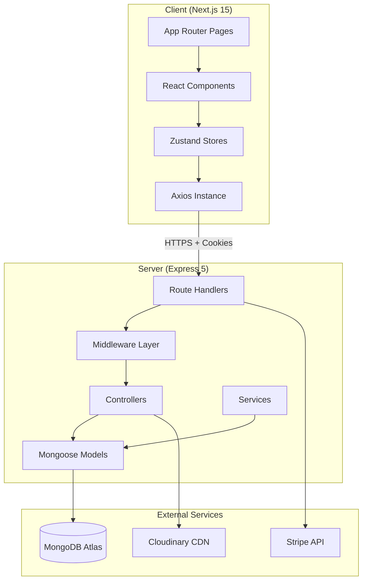
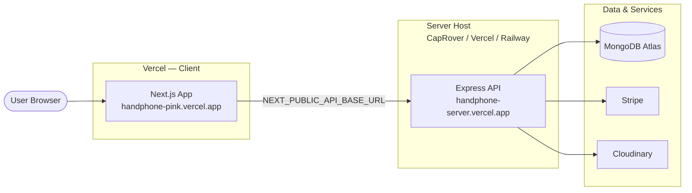
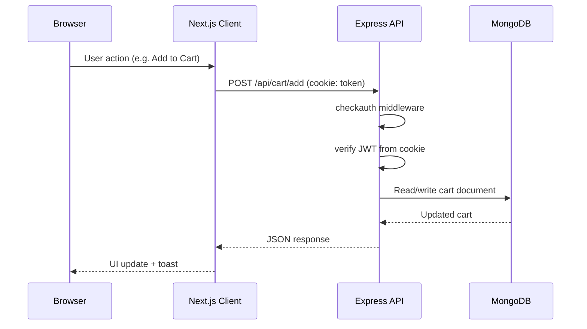
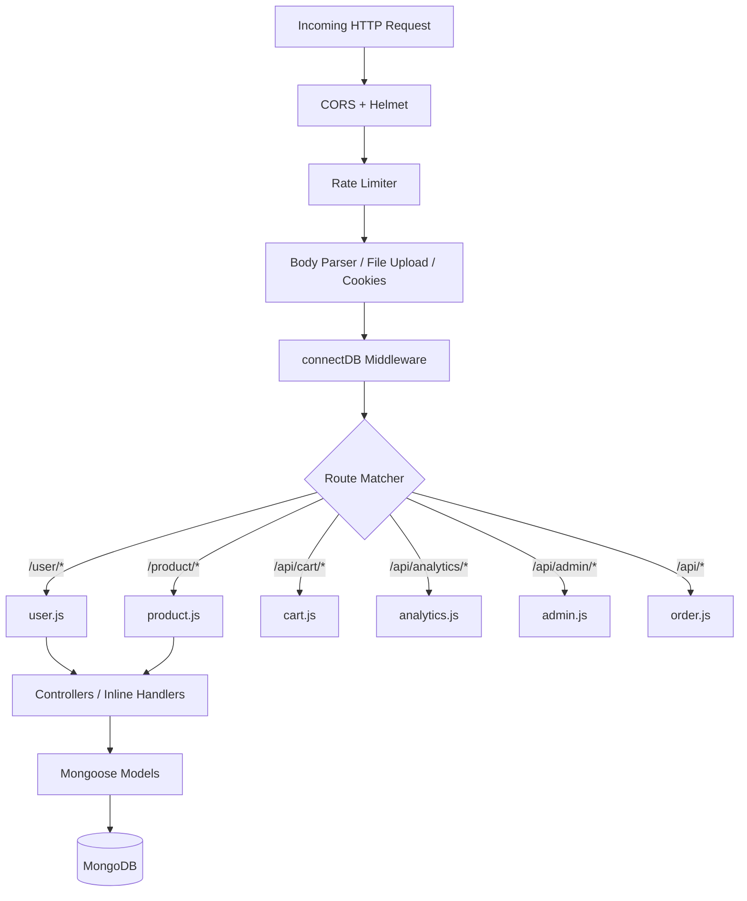
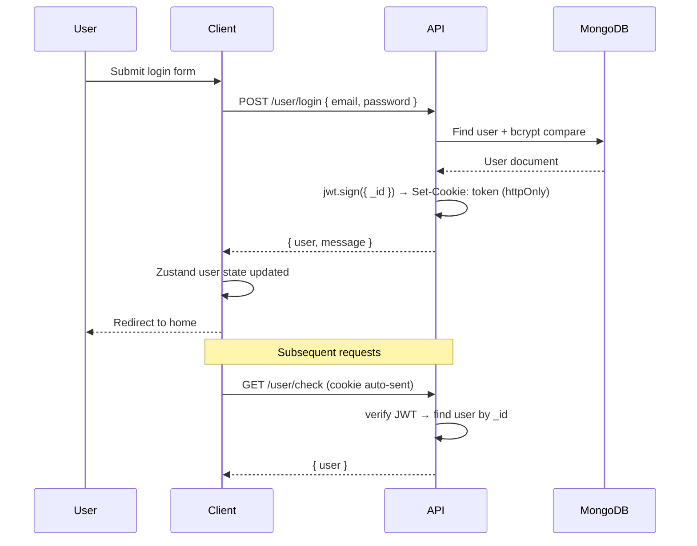
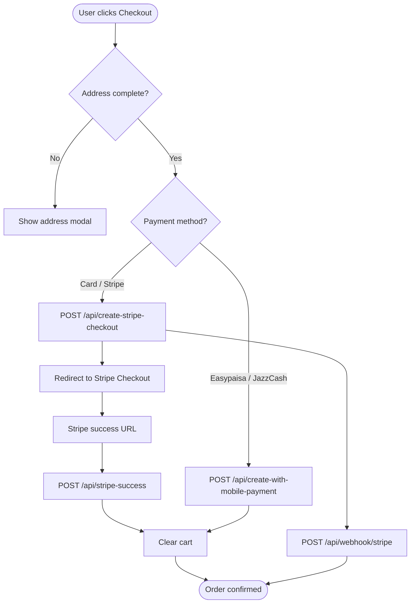
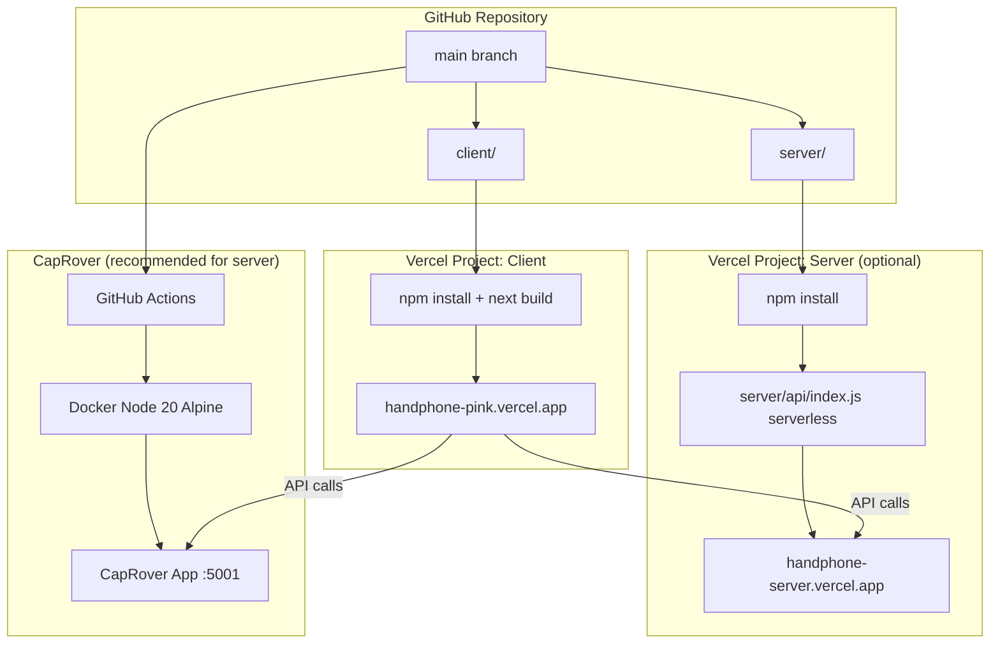

# Handphone — Full-Stack Ecommerce Platform

A monorepo ecommerce application for consumer electronics (phones, laptops, accessories, and more). The **client** is a Next.js 15 storefront and admin dashboard; the **server** is an Express 5 REST API backed by MongoDB. Client and server are developed, configured, and deployed **independently**.

---

## Table of Contents

1. [Overview](#overview)
2. [System Architecture](#system-architecture)
3. [Tech Stack](#tech-stack)
4. [Repository Structure](#repository-structure)
5. [Frontend Application](#frontend-application)
6. [Backend Application](#backend-application)
7. [Features](#features)
8. [State Management](#state-management)
9. [Authentication Flow](#authentication-flow)
10. [Checkout & Payment Flow](#checkout--payment-flow)
11. [Data Models](#data-models)
12. [API Reference](#api-reference)
13. [Environment Variables](#environment-variables)
14. [Installation & Local Development](#installation--local-development)
15. [Deployment Architecture](#deployment-architecture)
16. [Deployment Guides](#deployment-guides)
17. [CI/CD](#cicd)
18. [Security](#security)
19. [Known Limitations](#known-limitations)
20. [Contributing](#contributing)

---

## Overview

Handphone is a production-oriented ecommerce platform with two distinct applications:

| Application | Folder | Default Port | Purpose |
|---|---|---|---|
| **Client** | `client/` | `3000` | Customer storefront + admin dashboard |
| **Server** | `server/` | `5001` | REST API, auth, payments, analytics |

**Key capabilities:**
- Browse, search, and filter products by category, SKU, tags, and flags (featured, trending, hot, new)
- User registration, login, profile management, and role-based access (`customer` / `admin`)
- Shopping cart with stock-aware line items
- Checkout via **Stripe Checkout**, **Stripe Payment Intents**, and **simulated mobile payments** (Easypaisa / JazzCash style)
- Order lifecycle management (pending → confirmed → processing → shipped → delivered)
- Admin dashboards with revenue charts, customer management, and analytics
- Product media uploads via **Cloudinary**
- Cookie-based JWT authentication with CORS support for cross-origin client/server deployment

---

## System Architecture

### High-Level Architecture



### Deployment Architecture (Production)



### Request Flow (Authenticated API Call)



### Server Internal Layering



---

## Tech Stack

### Frontend (`client/`)

| Category | Technology | Version | Purpose |
|---|---|---|---|
| Framework | Next.js (App Router) | 15.4.10 | SSR, routing, build |
| UI Library | React | 19.1.0 | Component rendering |
| Styling | Tailwind CSS | 4.x | Utility-first CSS |
| State | Zustand | 5.x | Global client state |
| HTTP | Axios | 1.x | API calls with credentials |
| Payments | Stripe.js | 7.x / 3.x | Client-side checkout |
| Charts | Recharts | 3.x | Admin analytics charts |
| Animation | Framer Motion | 12.x | UI transitions |
| Icons | Lucide React, React Icons | — | Iconography |
| Carousel | Swiper | 11.x | Product sliders |
| Forms | React Hook Form | 7.x | Form validation |
| Notifications | React Hot Toast | 2.x | Toast messages |
| PDF | jsPDF, html2pdf.js | — | Order/export utilities |

### Backend (`server/`)

| Category | Technology | Version | Purpose |
|---|---|---|---|
| Runtime | Node.js | 18+ (20 recommended) | Server runtime |
| Framework | Express | 5.1.0 | HTTP API |
| Database | MongoDB + Mongoose | 8.x | Document persistence |
| Auth | jsonwebtoken + bcrypt | 9.x / 6.x | JWT cookies, password hashing |
| Payments | Stripe SDK | 18.x | Checkout sessions, webhooks |
| Media | Cloudinary | 1.x | Image upload & CDN |
| Security | Helmet, express-rate-limit | 8.x / 8.x | Headers, rate limiting |
| Upload | express-fileupload, multer | — | Multipart file handling |
| Email | Nodemailer | 7.x | Customer email (admin) |
| Config | dotenv | 17.x | Environment variables |

### DevOps & Deployment

| Tool | Purpose |
|---|---|
| Vercel | Client hosting (Next.js) |
| CapRover | Server Docker deployment |
| GitHub Actions | Auto-deploy server on push to `main` |
| Docker (Alpine Node 20) | Server container image |

---

## Repository Structure

```text
Handphone/
├── client/                          # Next.js frontend (deploy separately)
│   ├── public/                      # Static assets
│   ├── src/
│   │   ├── app/                     # App Router pages
│   │   │   ├── page.js              # Home / storefront
│   │   │   ├── layout.js            # Root layout
│   │   │   ├── globals.css          # Global styles
│   │   │   ├── middleware.js        # Edge auth middleware
│   │   │   ├── login/               # Login page
│   │   │   ├── signup/              # Registration page
│   │   │   ├── admin/               # Admin dashboard pages
│   │   │   │   ├── page.js          # Admin home / stats
│   │   │   │   ├── product/         # Product CRUD
│   │   │   │   ├── order/           # Order management
│   │   │   │   ├── analytics/       # Analytics dashboard
│   │   │   │   └── customer-management/
│   │   │   └── customers/           # Customer-facing pages
│   │   │       ├── products/        # Catalog, cart, checkout, details
│   │   │       ├── orders/          # Order history & detail
│   │   │       ├── profile/         # User profile
│   │   │       └── support/         # Support page
│   │   ├── components/              # Reusable UI components
│   │   └── Store/                   # Zustand stores + Axios config
│   ├── .env.example                 # Client env template
│   ├── .env.local                   # Client env (gitignored)
│   ├── next.config.mjs              # Next.js configuration
│   ├── tailwind.config.js           # Tailwind configuration
│   ├── vercel.json                  # Vercel deploy config
│   └── package.json
│
├── server/                          # Express API (deploy separately)
│   ├── api/
│   │   └── index.js                 # Vercel serverless entry point
│   ├── controllers/                 # Business logic handlers
│   │   ├── product.js
│   │   └── user.js
│   ├── middlewares/
│   │   └── checkauth.js             # JWT cookie auth middleware
│   ├── models/                      # Mongoose schemas
│   │   ├── user.js
│   │   ├── product.js
│   │   ├── cart.js
│   │   ├── order.js
│   │   └── Analytics.js
│   ├── routes/                      # Express route definitions
│   │   ├── user.js
│   │   ├── product.js
│   │   ├── cart.js
│   │   ├── order.js
│   │   ├── admin.js
│   │   └── analytics.js
│   ├── services/
│   │   ├── authentication.js        # JWT generate/verify
│   │   └── cloudinary.js            # Image upload service
│   ├── app.js                       # Express app factory
│   ├── index.js                     # Local/CapRover entry (app.listen)
│   ├── db.js                        # MongoDB connection cache
│   ├── loadEnv.js                   # Load server/.env
│   ├── captain-definition           # CapRover Docker config
│   ├── vercel.json                  # Vercel serverless config
│   ├── .env.example                 # Server env template
│   ├── .env                         # Server env (gitignored)
│   └── package.json
│
├── .github/workflows/
│   └── caprover-server-deploy.yml   # Auto-deploy server to CapRover
│
└── Readme.md
```

---

## Frontend Application

### Page Routes (App Router)

| Route | File | Access | Description |
|---|---|---|---|
| `/` | `app/page.js` | Protected | Home — hero, featured products, categories, sale items |
| `/login` | `app/login/page.js` | Public | User login |
| `/signup` | `app/signup/page.js` | Public | User registration |
| `/customers/products` | `customers/products/page.js` | Protected | Full product catalog with filters |
| `/customers/products/details/[id]` | `customers/products/details/[id]/page.js` | Protected | Product detail, quantity, add to cart |
| `/customers/products/cart` | `customers/products/cart/page.js` | Protected | Shopping cart |
| `/customers/products/checkout/success` | `customers/products/checkout/success/page.js` | Protected | Stripe success callback |
| `/customers/products/checkout/error` | `customers/products/checkout/error/page.js` | Protected | Checkout error page |
| `/customers/orders` | `customers/orders/page.js` | Protected | Order history list |
| `/customers/orders/[orderId]` | `customers/orders/[orderId]/page.js` | Protected | Single order detail + cancel |
| `/customers/profile` | `customers/profile/page.js` | Protected | Profile & address editing |
| `/customers/support` | `customers/support/page.js` | Protected | Support contact page |
| `/admin` | `admin/page.js` | Admin | Dashboard — stats, charts, recent orders |
| `/admin/product` | `admin/product/page.js` | Admin | Product CRUD with Cloudinary upload |
| `/admin/order` | `admin/order/page.js` | Admin | Order list, status updates |
| `/admin/analytics` | `admin/analytics/page.js` | Admin | Revenue, top products, categories |
| `/admin/customer-management` | `admin/customer-management/page.js` | Admin | Customer list, search, edit, delete |

### UI Components

| Component | File | Purpose |
|---|---|---|
| `Header` | `components/Header.js` | Top navigation bar |
| `Navbar` | `components/Navbar.js` | Main navigation links |
| `Topnavbar` | `components/Topnavbar.js` | Secondary top bar |
| `Bottomnavbar` | `components/Bottomnavbar.js` | Mobile bottom navigation |
| `ProductCard` | `components/ProductCard.js` | Product tile with cart action |
| `FilterSidebar` | `components/FilterSidebar.js` | Category/price filters |
| `Productsfilter` | `components/Productsfilter.js` | Product filter controls |
| `ShoppingCart` | `components/ShoppingCart.js` | Cart drawer / sidebar |
| `CheckoutModel` | `components/CheckoutModel.js` | Checkout modal (Stripe + mobile pay) |
| `Protectedroute` | `components/Protectedroute.js` | Auth guard wrapper |
| `Adminsidebar` | `components/Adminsidebar.js` | Admin panel sidebar navigation |

### Client → Server Communication

All API calls go through `src/Store/AxiosInstance.jsx`:

```javascript
baseURL: process.env.NEXT_PUBLIC_API_BASE_URL || 'http://localhost:5001'
withCredentials: true  // sends HTTP-only auth cookie cross-origin
```

---

## Backend Application

### Entry Points

| File | Used When | Behavior |
|---|---|---|
| `server/index.js` | Local dev, CapRover, Docker | Calls `app.listen(PORT)` |
| `server/api/index.js` | Vercel serverless | Exports Express app (no listen) |

### Middleware Stack (order matters)

1. **Trust proxy** — required behind Vercel/CapRover reverse proxies
2. **CORS** — allows configured frontend origins with credentials
3. **Helmet** — security headers (CSP disabled for API flexibility)
4. **Rate limiter** — 100 req / 15 min on `/api/`, `/user/`, `/product/`
5. **Raw body parser** — `/api/webhook` only (Stripe signature verification)
6. **JSON + URL-encoded parsers** — 10 MB limit
7. **express-fileupload** — multipart product image uploads
8. **cookie-parser** — reads JWT `token` cookie
9. **connectDB** — MongoDB connection (cached for serverless)
10. **Route handlers**

### Product Categories (enum)

`Computer`, `Laptop`, `Smartphone`, `Smart Watch`, `Earbuds`, `Desktop`, `TV`, `Tablet`, `Gaming Console`, `Headphones`, `Speaker`, `Camera`, `Monitor`, `Keyboard`, `Mouse`, `Accessories`

---

## Features

### Customer Features

| Feature | Description |
|---|---|
| Registration & Login | Email/password auth with JWT cookie session |
| Product Browsing | Home page with featured, sale, and category sections |
| Search & Filter | Search by keyword; filter by category, price, flags |
| Product Details | Images, specs, stock count, variant options, ratings |
| Shopping Cart | Add, update quantity, remove, clear; stock validation |
| Checkout | Stripe Checkout redirect, mobile payment simulation |
| Order History | Paginated list with status badges |
| Order Detail | Line items, billing, tracking, cancel order |
| Profile Management | Name, phone, address, profile image |
| Out-of-Stock UX | Product details visible; button shows "OUT OF STOCK" |

### Admin Features

| Feature | Description |
|---|---|
| Dashboard | Revenue, orders, customers, top products (period filter) |
| Product Management | Create, edit, delete products; Cloudinary image upload |
| Inventory | Stock quantity, status flags (active, low_stock, out_of_stock) |
| Order Management | View all orders, update status, edit customer info |
| Customer Management | List, search, stats, update, delete, send email |
| Analytics | Revenue trends, top products, category breakdown, customer metrics |
| Product Flags | Mark products as Hot, Trending, New, Featured |

### Platform / Backend Features

| Feature | Description |
|---|---|
| JWT Cookie Auth | HTTP-only, Secure, SameSite=None cookie |
| Role-Based Users | `customer` and `admin` roles |
| Stock Validation | Orders rejected when stock insufficient |
| Stripe Integration | Checkout sessions, payment intents, webhooks |
| Mobile Payments | Easypaisa / JazzCash simulation flow |
| Cloudinary Uploads | Product and profile image storage |
| Analytics Tracking | Page views, product views, cart, checkout, purchase events |
| Rate Limiting | Per-IP throttling on sensitive routes |
| Health Check | `GET /api/health` and `GET /` |

---

## State Management

Zustand stores in `client/src/Store/`:

| Store | File | Responsibility |
|---|---|---|
| `UserAuthStore` | `UserAuthStore.jsx` | Login, signup, logout, checkauth, profile update, customer list |
| `ProductStore` | `ProductStore.js` | CRUD operations, featured/trending/search/category fetches |
| `CartStore` | `CartStore.js` | Get cart, update/remove items, clear cart |
| `AdressStore` | `AdressStore.js` | Address management (partially stubbed) |
| `Messagestore` | `Messagestore.jsx` | Messaging (routes not fully wired) |
| `AxiosInstance` | `AxiosInstance.jsx` | Shared Axios client with credentials |

---

## Authentication Flow



**Cookie settings:** `httpOnly`, `secure`, `sameSite: None`, 30-day expiry.

**Protected routes** use the `checkauth` middleware which reads `req.cookies.token`, verifies JWT, and attaches `req.user`.

---

## Checkout & Payment Flow



**Payment methods supported:**
- `card` — Stripe Checkout / Payment Intents
- `easypaisa` — Simulated mobile payment
- `jazzcash` — Simulated mobile payment
- `cod` — Cash on delivery (schema support)

**Order amounts:** subtotal + shipping ($5 default) + tax − discount = totalAmount

---

## Data Models

### User (`users` collection)

| Field | Type | Notes |
|---|---|---|
| `name` | String | Required |
| `email` | String | Unique, required |
| `password` | String | bcrypt hashed, select: false |
| `phone` | String | Optional |
| `profileImg` | String | Cloudinary URL |
| `role` | Enum | `admin` \| `customer` |
| `status` | Enum | `active` \| `inactive` \| `new` |
| `segment` | Enum | `vip` \| `loyal` \| `regular` \| `new` |
| `totalOrders` | Number | Denormalized count |
| `totalSpent` | Number | Lifetime spend |
| `averageOrderValue` | Number | Computed average |
| `address` | Object | location, city, state, zipCode, country |

### Product (`products` collection)

| Field | Type | Notes |
|---|---|---|
| `name` | String | Max 200 chars |
| `category` | Enum | 16 electronics categories |
| `price` | Number | Current selling price |
| `originalPrice` | Number | For discount display |
| `discount` | Number | Percentage 0–100 |
| `stock` | Number | Inventory count |
| `sku` | String | Unique, uppercase |
| `description` / `shortDescription` | String | Full and card text |
| `brand` | String | Manufacturer |
| `status` | Enum | `active` \| `inactive` \| `out_of_stock` \| `low_stock` |
| `isHot` / `isTrending` / `isNew` / `isFeatured` | Boolean | Display flags |
| `images` | Array | `{ url, name, isPrimary }` |
| `tags` | String[] | Searchable tags |
| `specifications` | Array | `{ key, value }` pairs |
| `rating` / `reviews` | Number | Product rating metadata |
| `sales` | Number | Total units sold |

### Cart (`carts` collection)

One cart per user (`user` field is unique).

| Field | Type | Notes |
|---|---|---|
| `user` | ObjectId → User | Unique |
| `items[]` | Subdocuments | product, productName, sku, image, price, quantity, options |
| `subtotal` | Number | Auto-calculated on save |
| `totalItems` | Number | Line item count |
| `lastModified` | Date | Updated on each change |

### Order (`orders` collection)

| Field | Type | Notes |
|---|---|---|
| `orderNumber` | String | Auto-generated, unique |
| `user` | ObjectId → User | Customer |
| `items[]` | Subdocuments | product, quantity, price, selectedOptions |
| `billingInfo` | Object | name, email, phone, full address |
| `paymentMethod` | Enum | card, easypaisa, jazzcash, cod |
| `paymentData` | Object | transactionId, status, Stripe fields |
| `subtotal` / `shippingCost` / `tax` / `discount` | Number | Amount breakdown |
| `totalAmount` | Number | Final charge |
| `status` | Enum | pending → confirmed → processing → shipped → delivered / cancelled / refunded |
| `shippingInfo` | Object | method, trackingNumber, carrier, dates |
| `statusHistory[]` | Array | Audit trail of status changes |

### Analytics (`analytics` collection)

| Field | Type | Notes |
|---|---|---|
| `event` | Enum | page_view, product_view, add_to_cart, checkout_start, purchase |
| `userId` | ObjectId | Optional |
| `sessionId` | String | Required |
| `productId` | ObjectId | Optional |
| `value` | Number | Event monetary value |
| `metadata` | Mixed | Extra event data |

---

## API Reference

**Base URL (local):** `http://localhost:5001`

**Legend:** 🔒 = requires auth cookie | 🌐 = public

### Health

| Method | Endpoint | Auth | Description |
|---|---|---|---|
| GET | `/` | 🌐 | API status JSON |
| GET | `/api/health` | 🌐 | Health check with uptime |

### User Routes — `/user`

| Method | Endpoint | Auth | Description |
|---|---|---|---|
| POST | `/user/sign-up` | 🌐 | Register new customer |
| POST | `/user/login` | 🌐 | Login, sets JWT cookie |
| GET | `/user/logout` | 🌐 | Clears auth cookie |
| GET | `/user/check` | 🔒 | Verify session, return user |
| POST | `/user/update` | 🔒 | Update profile |
| GET | `/user/getusers` | 🔒 | Users for admin sidebar |
| POST | `/user/admin-register` | 🌐 | Create admin account |
| GET | `/user/customers` | 🔒 | List all customers |
| GET | `/user/customers/stats` | 🔒 | Customer statistics |
| GET | `/user/customers/search` | 🔒 | Search customers |
| GET | `/user/customers/:customerId` | 🔒 | Get customer by ID |
| PUT | `/user/customers/:customerId` | 🔒 | Update customer |
| DELETE | `/user/customers/:customerId` | 🔒 | Delete customer |
| POST | `/user/customers/:customerId/email` | 🔒 | Send email to customer |

### Product Routes — `/product`

| Method | Endpoint | Auth | Description |
|---|---|---|---|
| GET | `/product/getallproducts` | 🌐 | All products |
| GET | `/product/stats` | 🌐 | Product statistics |
| GET | `/product/featured` | 🌐 | Featured products (`?limit=`) |
| GET | `/product/trending` | 🌐 | Trending products |
| GET | `/product/new` | 🌐 | New arrivals |
| GET | `/product/hot` | 🌐 | Hot products |
| GET | `/product/search` | 🌐 | Search (`?q=&category=&minPrice=&maxPrice=`) |
| GET | `/product/category/:category` | 🌐 | Products by category |
| GET | `/product/sku/:sku` | 🌐 | Product by SKU |
| GET | `/product/:productId` | 🌐 | Product by MongoDB ID |
| POST | `/product/addproduct` | 🔒 | Create product (multipart) |
| PUT | `/product/:productId` | 🔒 | Update product |
| DELETE | `/product/:productId` | 🔒 | Delete product |

### Cart Routes — `/api/cart`

| Method | Endpoint | Auth | Description |
|---|---|---|---|
| GET | `/api/cart/get-cart` | 🔒 | Get user's cart |
| POST | `/api/cart/add` | 🔒 | Add item `{ productId, quantity }` |
| PUT | `/api/cart/update/:itemId` | 🔒 | Update item quantity |
| DELETE | `/api/cart/remove/:itemId` | 🔒 | Remove line item |
| DELETE | `/api/cart/clear` | 🔒 | Empty cart |
| GET | `/api/cart/count` | 🔒 | Total item count |

### Order Routes — `/api`

| Method | Endpoint | Auth | Description |
|---|---|---|---|
| POST | `/api/create-stripe-checkout` | 🔒 | Create Stripe Checkout session |
| POST | `/api/stripe-success` | 🔒 | Confirm order after Stripe redirect |
| POST | `/api/confirm-payment` | 🔒 | Confirm Stripe Payment Intent |
| POST | `/api/create-with-mobile-payment` | 🔒 | Simulated Easypaisa/JazzCash order |
| GET | `/api/my-orders` | 🔒 | Customer order history |
| GET | `/api/:orderId` | 🔒 | Single order detail |
| PATCH | `/api/:orderId/cancel` | 🔒 | Cancel order |
| POST | `/api/webhook/stripe` | 🌐 | Stripe webhook (raw body + signature) |
| GET | `/api/admin/orders` | 🔒 | Admin order list (paginated, filterable) |
| GET | `/api/admin/orders/:orderId` | 🔒 | Admin order detail |
| PATCH | `/api/admin/orders/:orderId/status` | 🔒 | Update order status |
| PATCH | `/api/admin/orders/:orderId/customer` | 🔒 | Update order customer info |
| GET | `/api/admin/orders/stats/dashboard` | 🔒 | Admin order statistics |

### Analytics Routes — `/api/analytics`

| Method | Endpoint | Auth | Description |
|---|---|---|---|
| GET | `/api/analytics/dashboard` | 🔒 | Analytics overview |
| GET | `/api/analytics/revenue-trends` | 🔒 | Revenue over time |
| GET | `/api/analytics/top-products` | 🔒 | Best-selling products |
| GET | `/api/analytics/categories` | 🔒 | Category performance |
| GET | `/api/analytics/customers` | 🔒 | Customer analytics |
| POST | `/api/analytics/track` | 🌐 | Track analytics event |

### Admin Dashboard Routes — `/api/admin`

| Method | Endpoint | Auth | Description |
|---|---|---|---|
| GET | `/api/admin/dashboard/stats` | 🌐 | Dashboard KPIs (`?period=`) |
| GET | `/api/admin/dashboard/revenue-chart` | 🌐 | Revenue chart data |
| GET | `/api/admin/dashboard/recent-orders` | 🌐 | Recent orders list |
| GET | `/api/admin/dashboard/top-products` | 🌐 | Top products by revenue |

---

## Environment Variables

### Server — `server/.env`

```bash
cd server && cp .env.example .env
```

| Variable | Required | Example | Description |
|---|---|---|---|
| `Mongo_Url` | Yes | `mongodb+srv://...` | MongoDB Atlas connection string |
| `PORT` | No | `5001` | Server port (default 5001) |
| `NODE_ENV` | No | `development` | Environment mode |
| `FRONTEND_URL` | Yes | `http://localhost:3000` | CORS + cookie origin |
| `STRIPE_REDIRECT_BASE_URL` | Yes | `http://localhost:3000` | Stripe success/cancel URLs |
| `STRIPE_SECRET_KEY` | Yes | `sk_test_...` | Stripe secret key |
| `STRIPE_WEBHOOK_SECRET` | Yes | `whsec_...` | Stripe webhook signing secret |
| `CLOUDINARY_CLOUD_NAME` | Yes | `your_cloud` | Cloudinary cloud name |
| `CLOUDINARY_API_KEY` | Yes | `123456789` | Cloudinary API key |
| `CLOUDINARY_API_SECRET` | Yes | `abc123` | Cloudinary API secret |

### Client — `client/.env.local`

```bash
cd client && cp .env.example .env.local
```

| Variable | Required | Example | Description |
|---|---|---|---|
| `NEXT_PUBLIC_API_BASE_URL` | Yes | `http://localhost:5001` | Server API base URL |
| `NEXT_PUBLIC_API_URL` | No | `http://localhost:5001/product` | Product API fallback |
| `NEXT_PUBLIC_STRIPE_PUBLISHABLE_KEY` | Yes | `pk_test_...` | Stripe publishable key |

**Production cross-origin setup:**

```text
Client (Vercel):  NEXT_PUBLIC_API_BASE_URL = https://handphone-server.vercel.app
Server (Vercel):  FRONTEND_URL            = https://handphone-pink.vercel.app
                  STRIPE_REDIRECT_BASE_URL = https://handphone-pink.vercel.app
```

---

## Installation & Local Development

### Prerequisites

- Node.js 18+ (20+ recommended)
- npm 9+
- MongoDB Atlas cluster (or local MongoDB)
- Stripe account (test mode)
- Cloudinary account

### Install

```bash
cd server && npm install
cd ../client && npm install
```

### Run (two terminals)

**Terminal 1 — API Server:**
```bash
cd server
cp .env.example .env        # first time only
npm run dev
# → http://localhost:5001
```

**Terminal 2 — Frontend:**
```bash
cd client
cp .env.example .env.local  # first time only
npm run dev
# → http://localhost:3000
```

### Scripts

| App | Command | Description |
|---|---|---|
| `server/` | `npm run dev` | Start API (Node) |
| `server/` | `npm start` | Production API |
| `client/` | `npm run dev` | Next.js dev server |
| `client/` | `npm run build` | Production build |
| `client/` | `npm start` | Production Next.js server |

---

## Deployment Architecture



---

## Deployment Guides

### Client → Vercel

1. Create a Vercel project linked to this repo
2. **Root Directory:** `client`
3. **Framework Preset:** Next.js
4. **Install Command:** `npm install` (set in `client/vercel.json`)
5. Add env vars from `client/.env.example`
6. Deploy

### Server → Vercel (Serverless)

1. Create a **separate** Vercel project
2. **Root Directory:** `server`
3. **Framework Preset:** Other
4. Add all vars from `server/.env.example`
5. Uses `server/api/index.js` + `server/vercel.json`
6. Set `FRONTEND_URL` to your client Vercel URL

> **Note:** CapRover/Railway/Render is recommended for the API — no cold starts, no function timeout limits.

### Server → CapRover (Recommended)

1. Create CapRover app (e.g. `handphone-server`), port **5001**
2. Set env vars from `server/.env.example` in CapRover app settings
3. Add GitHub secrets: `CAPROVER_SERVER`, `CAPROVER_APP`, `CAPROVER_APP_TOKEN`
4. Push to `main` — workflow auto-deploys `server/` folder

**Docker image** (from `server/captain-definition`):
```dockerfile
FROM node:20-alpine
WORKDIR /usr/src/app
COPY package*.json ./
RUN npm install --omit=dev
COPY . .
ENV NODE_ENV=production
EXPOSE 5001
CMD ["npm", "start"]
```

### Stripe Webhook Setup

After server is deployed, register webhook in Stripe Dashboard:

```text
Endpoint: https://your-server-domain/api/webhook/stripe
Events:   checkout.session.completed, payment_intent.succeeded
Secret:   → set as STRIPE_WEBHOOK_SECRET in server env
```

---

## CI/CD

### GitHub Actions — Server Auto-Deploy

**File:** `.github/workflows/caprover-server-deploy.yml`

**Triggers:**
- Push to `main` / `master` when `server/**` changes
- Manual `workflow_dispatch`

**Steps:**
1. Validate CapRover secrets
2. Create `deploy.tar` from `server/` folder only
3. Deploy to CapRover via `caprover/deploy-from-github@v1.2.0`

**Required GitHub Secrets:**

| Secret | Description |
|---|---|
| `CAPROVER_SERVER` | CapRover dashboard URL |
| `CAPROVER_APP` | App name in CapRover |
| `CAPROVER_APP_TOKEN` | Deploy token from CapRover app |

---

## Security

| Layer | Implementation |
|---|---|
| Authentication | JWT in HTTP-only cookie (`token`) |
| Password Storage | bcrypt hashing |
| CORS | Origin whitelist via `FRONTEND_URL` env |
| Headers | Helmet (CSP disabled for API) |
| Rate Limiting | 100 requests / 15 min per IP |
| File Upload | express-fileupload with size limits |
| Stripe Webhooks | Signature verification via `STRIPE_WEBHOOK_SECRET` |
| HTTPS | Required in production for secure cookies |

**Cross-origin cookie requirements (production):**
- Server cookie: `secure: true`, `sameSite: 'None'`
- Client Axios: `withCredentials: true`
- Server CORS: `credentials: true`, frontend origin whitelisted

---

## Known Limitations

| Item | Detail |
|---|---|
| JWT secret | Hardcoded as `'12345'` in `server/services/authentication.js` — move to env var for production |
| Admin route auth | Some admin dashboard routes lack role enforcement beyond `checkauth` |
| Analytics model | Duplicate route snippet exists at bottom of `Analytics.js` model file |
| Message routes | `Messagestore.jsx` references `/message/*` routes not implemented in server |
| Address store | `AdressStore.js` is commented out / not wired |
| Serverless cold starts | Vercel server deployment may have 1–3s cold start latency |
| Mobile payments | Easypaisa/JazzCash are simulated, not connected to real gateways |

---

## Contributing

1. Fork the repository
2. Create a feature branch: `git checkout -b feature/your-feature`
3. Make changes scoped to `client/` or `server/` independently
4. Test locally with both apps running
5. Open a pull request with a clear description and test notes

---

## License

Private project — all rights reserved.
